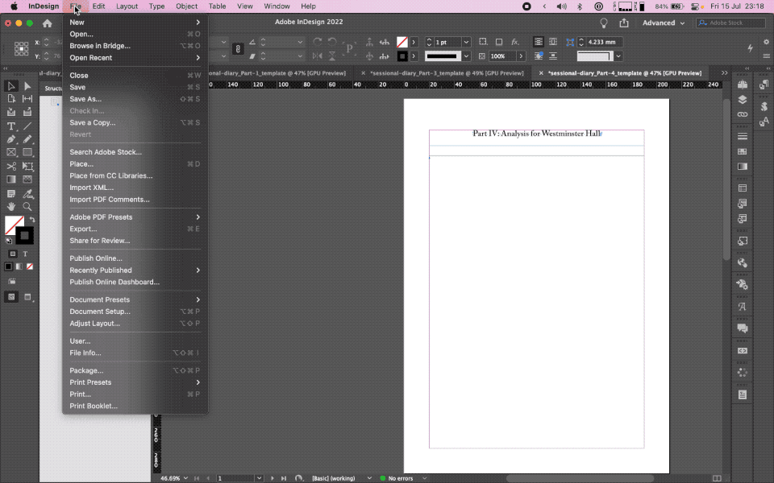

# Sessional Diary

Creates the House of Commons sessional diary PDF from an Excel file. The tool
reads the Excel file and produces XML files that are imported into Adobe InDesign
templates; a PDF can then be exported from InDesign.

Previously published Excel files and PDFs are on the
[UK Parliament website](https://www.parliament.uk/business/publications/commons/sessional-diary/).

## Before you start

You will need:

- [uv](https://docs.astral.sh/uv/getting-started/installation/) — manages Python
  and dependencies for you. You do **not** need to install Python separately.
- A recent version of [Adobe InDesign](https://www.adobe.com/products/indesign.html).
- A copy of this repository —
  [here is a guide to cloning](https://www.youtube.com/watch?v=CKcqniGu3tA),
  or download and extract the ZIP if you do not have git.

## Installation

From inside the cloned repository, run:

```bash
uv sync
```

This creates a virtual environment and installs all dependencies. You do not need
to activate anything.

## Usage

### Command line

Pass your Excel file to the `sessional-diary` command:

```bash
uv run sessional-diary "2021-22 sessional diary data.xlsx"
```

Output files are written to the same folder as your Excel file.

#### Options

| Option | Description |
|--------|-------------|
| `--no-excel` | Skip the Excel analysis output |
| `--include-only chamber` | Produce only the Chamber (House) sections |
| `--include-only wh` | Produce only the Westminster Hall sections |

For full usage information:

```bash
uv run sessional-diary --help
```

### Graphical interface

To pick the input file and output folder using a window:

```bash
uv run gui
```

> **Note:** the graphical interface requires Tk (tkinter). The Python that uv
> installs includes it automatically. If you use a system Python that lacks
> tkinter, use the command line instead, or on Linux install `python3-tk`.

### Output files

By default the tool produces:

| File | Contents |
|------|----------|
| `House_Diary.xml` | Chamber diary |
| `House_Analysis.xml` | Chamber analysis |
| `House_An_Contents.xml` | Chamber analysis table of contents |
| `WH_diary.xml` | Westminster Hall diary |
| `WH_Analysis.xml` | Westminster Hall analysis |
| `WH_An_Contents.xml` | Westminster Hall analysis table of contents |
| `Analysis.xlsx` | Excel version of the analysis sections |

## InDesign instructions

Open all the template `.idml` files (in the `templates/` folder) with InDesign.
Immediately **Save As** with a name that includes the session,
e.g. `sessional-diary-2021-22_Part-1.indd`. Close the `.idml` files.

Use an InDesign book for correct page numbering and to make exporting a single
PDF easier. Follow the
["Create an InDesign book file" and "Add documents to a book file"](https://redokun.com/blog/indesign-book#toc-3)
steps if you are unsure. Add all 5 `.indd` files — you cannot add `.idml` files
to an InDesign book.

Import the XML for Parts 1–4 into the relevant InDesign file:



If the text does not flow to multiple pages automatically, follow the instructions
in this [YouTube video](https://youtu.be/jUP1kMsIYV0?t=97) (from about 1:37).

#### Table of contents

1. Use InDesign's built-in **Table of Contents** feature to generate the contents.
2. Convert the result to a proper table using **Convert Text to Table**.
3. Create new text frames off the page.
4. Import `House_An_Contents.xml` or `WH_An_Contents.xml` into those off-page text frames.
5. Add columns to the generated contents table.
6. Copy the relevant columns from the imported XML tables into the contents table.
7. Format to match the previous session's style.

To export the PDF, use **Export Book to PDF…** in the InDesign book panel menu.
